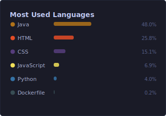

 

 

 

---

## 🧠 About Me

I'm a passionate **AI Developer** based in Tunisia, currently studying at the **National Engineering School of Sfax (ENIS)**. I specialize in building intelligent systems at the intersection of machine learning, full-stack development, and cloud infrastructure.

- 💼 Portfolio: [ahmedguebsi.github.io/](https://ahmedguebsi.github.io/)
- 🌱 Currently deepening expertise in **LLMs, MLOps, and distributed systems**
- 🤝 Open to collaboration on **AI/ML projects and open-source contributions**
- 📫 Reach me at **ahmed.guebsi@enis.tn**
- ⚡ Fun fact: I treat complex problems like chess — always thinking three moves ahead

---

## 🛠️ Tech Stack

### 🤖 AI & Machine Learning

### ⚙️ Backend & Systems

### 🎨 Frontend

### 🗄️ Databases

### ☁️ Cloud, DevOps & Infrastructure

---

## 📊 GitHub Stats

  
  

  

---

## 🏆 GitHub Trophies

  

---

## 📈 Contribution Activity

  

---

  
📺 Latest YouTube Videos

   

  <!-- To enable: set your channel_id in .github/workflows/youtube-cards.yml, then uncomment the cron schedule and run the workflow. -->
  <!-- BEGIN YOUTUBE-CARDS -->
  <!-- END YOUTUBE-CARDS -->

---

*"The only way to do great work is to love what you do."*

